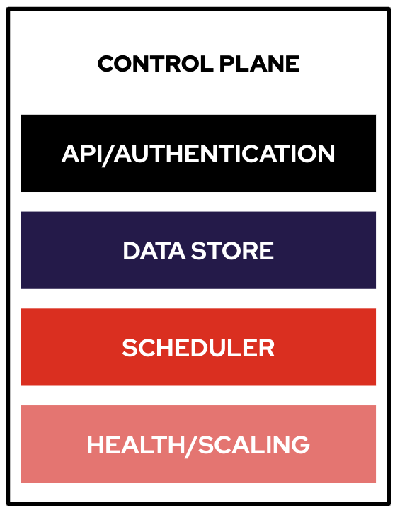

## Installation and Verification

The scope of the installer-provisioned infrastructure (IPI) OpenShift 4
installation is purposefully narrow. It is designed for simplicity and
ensured success. Many of the items and configurations that were previously
handled by the installer are now expected to be "Day 2" operations, performed
just after the installation of the control plane and basic workers completes.
The installer provides a guided experience for provisioning the cluster on a
particular platform.

This IPI installation has already been performed for you, and the cluster is
in its basic, default state.

### Logging in
To inspect the cluster installation, you can simply SSH to the bastion host where it was installed on like so:

[source,bash,role="execute"]
----
ssh -l {{ SSH_USERNAME }} {{ BASTION_FQDN }} -o ServerAliveInterval=120
----

You'll also find this command on the workshop credential page you used to log in with. It'll look something like this:


----
[~] $ ssh -l lab-user bastion.kdcfh.sandbox2962.opentlc.com -o ServerAliveInterval=120
----


You might see the following message:
----
The authenticity of host 'bastion.xxxxx.sandbox000.opentlc.com (x.x.x.x.' can't be established.
ECDSA key fingerprint is SHA256:ZZZZzzzzzzZZZZZzzzzzzZZZZZZzzzzzzzZZZZzzZZz.
ECDSA key fingerprint is MD5:12:34:56:78:9a:bc:de:f1:23:45:67:89:ab:cd:ef:10.
Are you sure you want to continue connecting (yes/no)?
----

If so, type `yes`:

[source,bash,role="execute"]
----
yes
----

Here is your ssh password (please copy/paste):

----
{{ SSH_PASSWORD }}
----

Once you've SSH-ed into the bastion host, become the `ec2-user`:

[source,bash,role="execute"]
----
sudo su - ec2-user
----

You'll notice that there is a 5-digit alphanumeric string (eg: b866q) in the hostname. This
string is your `GUID`. Since you will often use `GUID`, it makes sense to
export it as an environment variable:

[source,bash,role="execute"]
----
export GUID=`hostname | cut -d. -f2`
----

### Master Components

.OpenShift Master's 4 main responsibilities.



#### API/Authentication
The Kubernetes API server validates and configures the resources that make up a Kubernetes cluster.

Common things that interact with the Kubernetes API server are:

* OpenShift Web Console
* OpenShift `oc` command line tool
* OpenShift Node
* Kubernetes Controllers

All interactions with the API server are secured using TLS. In addition, all
API calls must be authenticated (the user is who they say they are) and
authorized (the user has rights to make the requested API calls).


#### Data Store
The OpenShift Data Store (etcd) stores the persistent master state while
other components watch etcd for changes to bring themselves into the desired
state. etcd is configured for high availability, and is deployed with
2n+1 peer services.

[Note]
====
etcd stores the cluster's state. It is not used to store user application data.
====

#### Scheduler
The pod scheduler is responsible for determining placement of new pods onto
nodes within the cluster.

The scheduler is very flexible and can take the physical topology of the
cluster into account (racks, datacenters, etc).

#### Health / Scaling
Each pod can register both liveness and readiness probes.

Liveness probes tell the system if the pod is healthy or not. If the pod is
not healthy, it can be restarted automatically.

Readiness probes tell the system when the pod is ready to take traffic. This,
for example, can be used by the cluster to know when to put a pod into the
load balancer.

For more information on the OpenShift Master's areas of responsibility, please refer to
the
link:https://docs.openshift.com/container-platform/4.14/architecture/control-plane.html[infrastructure components section] of the product documentation.

### Examining the installation artifacts
OpenShift 4 installs with two effective superusers:

* `kubeadmin` (technically an alias for `kube:admin`)
* `system:admin`

Why two? Because `system:admin` is a user that uses a certificate to login
and has no password. Therefore this superuser cannot log-in to the web
console (which requires a password).

If you want additional users to be able to authenticate to and use the
cluster, you need to configure your desired authentication mechanisms using
CustomResources and Operators as previously discussed. LDAP-based
authentication will be configured as one of the lab exercises.

### Verifying the Installation
Let's do some basic tests with your installation. As an administrator, most
of your interaction with OpenShift will be from the command line. The `oc`
program is a command line interface that talks to the OpenShift API.

#### Login to OpenShift
When the installation completed, the installer left some artifacts that
contain the various URLs and passwords required to access the environment.
The installation program was run under the `ec2-user` account.

[source,bash,role="execute"]
----
ls -al ~/cluster-$GUID
----

You'll see something like the following:

----
total 3112
drwxrwxr-x.  4 ec2-user ec2-user    4096 Jun 28 08:08 .
drwx------. 13 ec2-user ec2-user    4096 Jun 28 08:24 ..
drwxr-x---.  2 ec2-user ec2-user      50 Jun 28 07:35 auth
-rw-r-----.  1 ec2-user ec2-user      32 Jun 28 07:41 bootstrap.tfvars.json
-rw-r-----.  1 ec2-user ec2-user     816 Jun 28 07:41 cluster.tfvars.json
-rw-rw----.  1 ec2-user ec2-user    4127 Jun 28 07:34 install-config.yaml.bak
-rw-r-----.  1 ec2-user ec2-user     375 Jun 28 07:35 metadata.json
-rw-rw-r--.  1 ec2-user ec2-user  604714 Jun 28 08:07 .openshift_install.log
-rw-rw-r--.  1 ec2-user ec2-user   31303 Jun 28 08:08 .openshift_install.log.gz
-rw-r-----.  1 ec2-user ec2-user 1970047 Jun 28 07:41 .openshift_install_state.json
-rw-r-----.  1 ec2-user ec2-user     181 Jun 28 07:55 terraform.bootstrap.tfstate
-rw-r-----.  1 ec2-user ec2-user  232882 Jun 28 07:41 terraform.cluster.tfstate
-rw-r-----.  1 ec2-user ec2-user    1457 Jun 28 07:35 terraform.platform.auto.tfvars.json
-rw-r-----.  1 ec2-user ec2-user  305517 Jun 28 07:35 terraform.tfvars.json
drwxr-x---.  2 ec2-user ec2-user      62 Jun 28 07:35 tls
----

The OpenShift 4 IPI installation embeds Terraform in order to create some of
the cloud provider resources. You can see some of its outputs here. The
important file right now is the `.openshift_install.log`. Its last few lines
contain the relevant output to figure out how to access your environment
(sometimes you need to increase the -n10 to e.g. -n15):

[source,bash,role="execute"]
----
tail -n10 ~/cluster-$GUID/.openshift_install.log
----

You will see something like the following::

----
time="2024-06-28T08:07:57Z" level=info msg="Login to the console with user: \"kubeadmin\", and password: \"fqEik-f
RyGN-C9fxo-9tFV3\""
time="2024-06-28T08:07:57Z" level=debug msg="Time elapsed per stage:"
time="2024-06-28T08:07:57Z" level=debug msg="                    cluster: 5m11s"
time="2024-06-28T08:07:57Z" level=debug msg="                  bootstrap: 1m9s"
time="2024-06-28T08:07:57Z" level=debug msg="         Bootstrap Complete: 11m33s"
time="2024-06-28T08:07:57Z" level=debug msg="                        API: 2m5s"
time="2024-06-28T08:07:57Z" level=debug msg="          Bootstrap Destroy: 2m6s"
time="2024-06-28T08:07:57Z" level=debug msg="Cluster Operators Available: 12m9s"
time="2024-06-28T08:07:57Z" level=debug msg="   Cluster Operators Stable: 39s"
time="2024-06-28T08:07:57Z" level=info msg="Time elapsed: 33m0s"
----

The installation was run as a different system user, and the artifacts folder
is read-only mounted into your `lab-user` folder. While the installer has
fortunately given you a convenient `export` command to run, you don't have
write permissions to the path that it shows. The `oc` command will try to
write to the `KUBECONFIG` file, which it can't, so you'll get errors later if you try it.

Our installation process has actually already copied the config you need to
`~/.kube/config`, so you are already logged in. Try the following:

[source,bash,role="execute"]
----
oc whoami
----

The `oc` tool should already be in your path and be executable.

#### Examine the Cluster Version
First, you can check the current version of your OpenShift cluster by
executing the following:

[source,bash,role="execute"]
----
oc get clusterversion
----

And you will see some output like:

```
NAME      VERSION   AVAILABLE   PROGRESSING   SINCE   STATUS
version   4.15.18   True        False         141m    Cluster version is 4.15.18
```

For more details, you can execute the following command:

[source,bash,role="execute"]
----
oc describe clusterversion
----

Which will give you additional details, such as available updates:

```
Name:         version
Namespace:
Labels:       <none>
Annotations:  <none>
API Version:  config.openshift.io/v1
Kind:         ClusterVersion
Metadata:
  Creation Timestamp:  2024-06-28T07:44:21Z
  Generation:          2
  Managed Fields:
    API Version:  config.openshift.io/v1
    Fields Type:  FieldsV1
    fieldsV1:
      f:spec:
        .:
        f:channel:
        f:clusterID:
    Manager:      cluster-bootstrap
    Operation:    Update
    Time:         2024-06-28T07:44:21Z
    API Version:  config.openshift.io/v1
    Fields Type:  FieldsV1
    fieldsV1:
...
    Manager:         cluster-version-operator
    Operation:       Update
    Subresource:     status
    Time:            2024-06-28T08:36:17Z
  Resource Version:  70416
  UID:               fe17fc81-024a-4b91-815d-7d1e77e7b687
Spec:
  Channel:     stable-4.15
  Cluster ID:  3d0060f3-5d66-4fc8-a95b-b93a4cc6d6e0
Status:
  Available Updates:  <nil>
...
```

#### Look at the Nodes
Execute the following command to see a list of the *Nodes* that OpenShift knows
about:

[source,bash,role="execute"]
----
oc get nodes
----

The output should look something like the following:

----
NAME                                        STATUS   ROLES                  AGE    VERSION
ip-10-0-16-246.us-east-2.compute.internal   Ready    control-plane,master   164m   v1.28.10+a2c84a5
ip-10-0-17-9.us-east-2.compute.internal     Ready    worker                 158m   v1.28.10+a2c84a5
ip-10-0-33-169.us-east-2.compute.internal   Ready    control-plane,master   164m   v1.28.10+a2c84a5
ip-10-0-57-204.us-east-2.compute.internal   Ready    worker                 157m   v1.28.10+a2c84a5
ip-10-0-94-203.us-east-2.compute.internal   Ready    control-plane,master   164m   v1.28.10+a2c84a5
----

You have 3 masters and 2 workers. The OpenShift *Master* is also a *Node*
because it needs to participate in the software defined network (SDN). If you
need additional nodes for additional purposes, you can create them very
easily when using IPI and leveraging the cloud provider operators. You will
create nodes to run OpenShift infrastructure components (registry, router,
etc.) in a subsequent exercise.

Exit out of the `ec2-user` user shell.
[source,role="execute"]
----
exit
----

#### Check the Web Console
OpenShift provides a web console for users, developers, application
operators, and administrators to interact with the environment. Many of the
cluster administration functions, including upgrading the cluster itself, can
be performed simply by using the web console.

The web console actually runs as an application inside the OpenShift
environment and is exposed via the OpenShift Router. You will learn more
about the router in a subsequent exercise.

This lab comes with an integrated webconsole but we recommend you use the external one.

image::images/consoletab.png[]

If you find that something isn't working (or simply not there); 
please feel free to open the web console in another tab. 
You can do this by simply control+click the following link:

{{ MASTER_URL }}

#### You will now exit the ssh session
[source,role="execute"]
----
exit
----
If you accidentally hit exit more than once and connection to the console closed, refresh the webpage to reconnect.

[Warning]
====
You might receive a self-signed certificate error in your browser when you
first visit the web console. When OpenShift is installed, by default, a CA
and SSL certificates are generated for all inter-component communication
within OpenShift, including the web console. Some lab instances were
installed with Let's Encrypt certificates, so not all will get this
warning.
====
